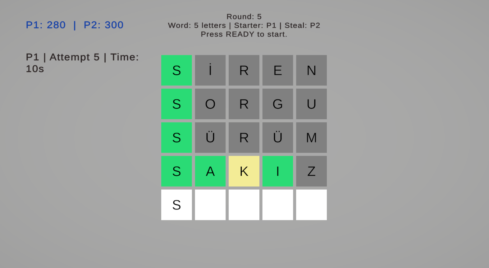

# Unity Lingo Game

This project is a playable prototype developed in Unity within two days, inspired by Lingo-style word quiz shows that my parents have been watching for years.

## About
Rather than aiming for a full commercial product, the goal of this project was to quickly translate the core elements of the show into an interactive experience, including:
- the main gameplay loop,
- turn-based progression,
- time pressure,
- and player-versus-player tension.

The result is a small-scale but well-structured prototype with clear rules, readable gameplay flow, and room for further expansion.

## Key Highlights
- Turn-based word guessing system
- Time-limited attempts
- Letter-based visual feedback (correct / present / absent)
- Steal mechanic triggered after failed attempts
- Clean and readable Unity architecture

## Why This Project?
This project was created to:
- explore rapid prototyping workflows,
- turn a game idea into a playable experience in a short time,
- and build a simple yet competitive game that can be enjoyed with family.

It is not intended to be an advanced production, but it is built on solid foundations and could be expanded further if desired.

In short, this project answers the question:  
**“How clean and playable can a game be when built in just two days?”**

## Screenshot

  

